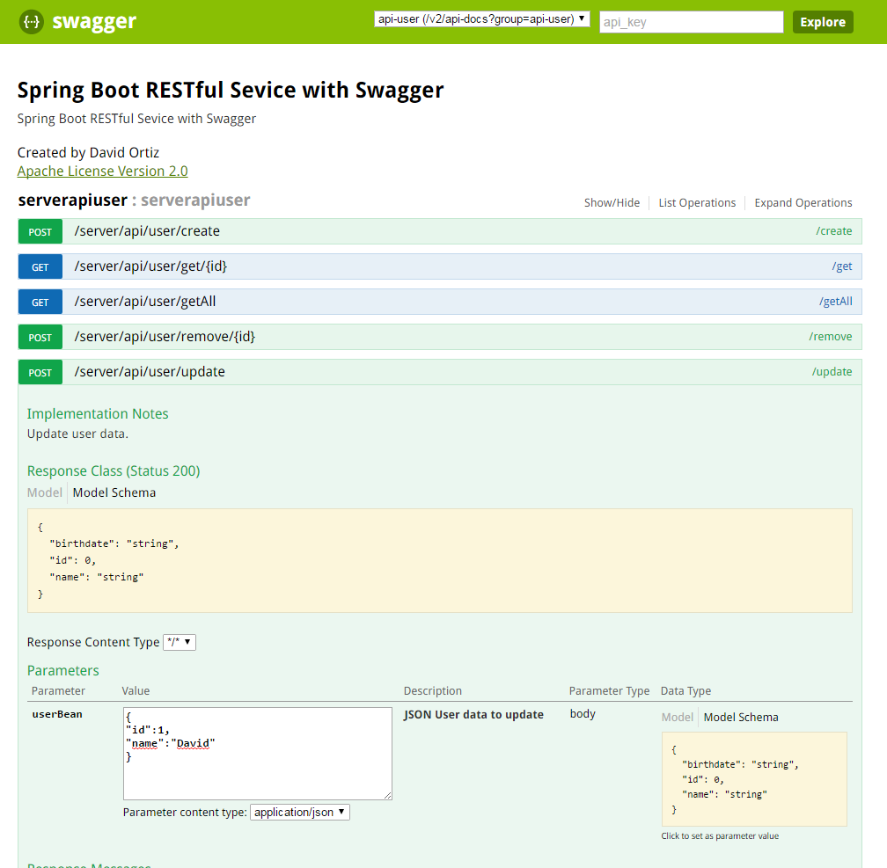

# RESTful Simple Project. (Spring Boot + hsqldb + postgreSQL + Swagger2)

This repository is a simple example of a RESTful service with Spring Boot.


### Description

In this example, Spring Boot has been used to perform a RESTful service for user management. It includes:
* Operation to create users (/api/user/create).
* Operation for modification of user data (/api/user/update)
* Operation for deleting users (/api/user/remove).
* Operation for user query (/api/user/get)
* Operation for all users query (/api/user/getAll)


### Profiles
Two profiles have been created for this example:

##### Development profile

* Default profile
* Profile 'desa'
* Uses hsqldb database

The configuration of the database is done in two files:
`application.yml`

```
spring:
  profiles.active: desa
  
---

spring:
    profiles: desa
server:
    port: 9000
```

and `application-desa.properties`

```
spring.jpa.show-sql=true
spring.jpa.generate-ddl=true
spring.jpa.hibernate.ddl-auto=update
```


##### Production profile

* Profile 'prod'
* Uses a postgresql database

The configuration of the database is done in two files:
`application.yml`

```
spring:
    profiles: prod
server:
    port: 9010
```

and `application-prod.properties`

```
spring.datasource.url=jdbc:postgresql://127.0.0.1/cloud
spring.datasource.username=jira
spring.datasource.password=jira
spring.datasource.driver-class-name=org.postgresql.Driver

spring.jpa.show-sql=true
spring.jpa.database-platform=org.hibernate.dialect.PostgreSQLDialect
spring.jpa.generate-ddl=true
spring.jpa.hibernate.ddl-auto=update

logging.level.org.apache.velocity=DEBUG
```


### Integrations
Este código integra Swagger2, por lo que dispone de una interfaz gráfica donde poder ver y ejecutar las operaciones del servicio REST.
This code integrates Swagger2, so it has a graphical interface where you can view and execute the operations of the REST service.

The url's for Swagger2 are:

##### Development profile
```
http://server:9000/swagger-ui.html
```
##### Production profile
```
http://server:9010/swagger-ui.html
```




### Executions

To run the application, the command
```
mvn spring-boot:run
```
This command will execute the ***default profile (desa)***,so the application will boot into port **9000** of our server.


To execute the ***production profile***, execute the command
```
mvn spring-boot:run -Drun.profiles=prod
```
the application will boot into port **9010** of our server.